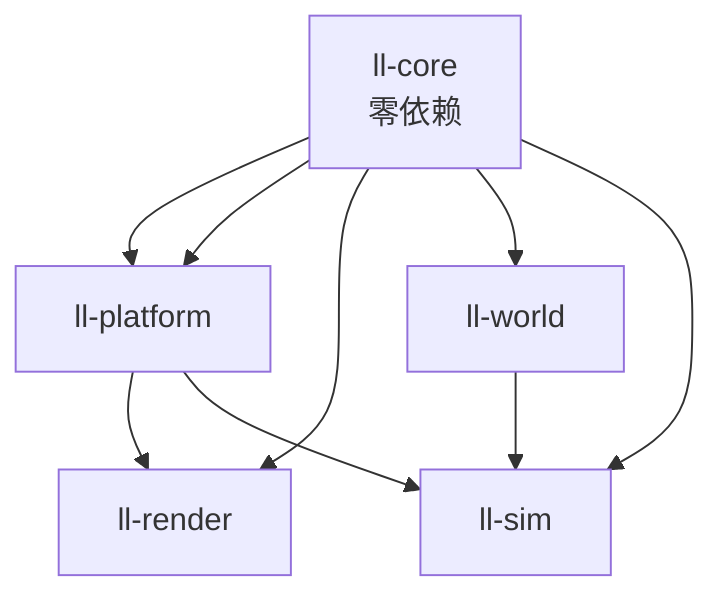

# Crate 分层与依赖方向

**冻结时间**：2026-08-17，核对提交 `7a126f5`。
依赖图由 `cargo tree --workspace -e no-dev` 与各 `crates/*/Cargo.toml` 实测得出，**不是抄规格 §5 的文字描述**。

## 现状：只有 5 个 crate 存在

规格 §5 列了 12 个 `crates/*` 与 5 个 `tools/*`，但截至本次核对，`crates/` 下只有：

```
crates/
  ll-core       ll-platform     ll-render
  ll-world      ll-sim
```

`ll-text`、`ll-audio`、`ll-script`、`ll-mod`、`ll-content`、`ll-ui`、`ll-app` 与整个 `tools/` 目录
**尚未创建**。这不是遗漏，是项目当前处于 P3（回合与战斗层）阶段，规格 §15 的阶段表把这些 crate
排在 P4 及以后。读规格 §5 的完整依赖链时请留意：那是**终态设计图**，不是当前可以在仓库里找到的东西。

## 真实依赖图（生产依赖，不含 dev-dependencies）



（`ll-core --> platform` 重复画是 mermaid 语法限制，实际只有一条边；下面的表格是准确来源。）

### 逐 crate 生产依赖（摘自各 `Cargo.toml` 的 `[dependencies]`）

| crate | 依赖的本仓库 crate | 关键第三方依赖 |
|---|---|---|
| `ll-core` | 无 | `serde`（`optional = true`，见下） |
| `ll-platform` | `ll-core` | `winit`、`tracing`、`rayon`、`crossbeam-channel` |
| `ll-render` | `ll-core`、`ll-platform` | `wgpu`、`image`、`bytemuck`、`pollster` |
| `ll-world` | `ll-core`（开 `serde` feature） | `serde` |
| `ll-sim` | `ll-core`（开 `serde` feature）、`ll-platform`、`ll-world` | `serde` |

`ll-core/Cargo.toml` 顶部注释说明了它「默认零运行时依赖」的取舍：`serde` 是唯一例外，且以
`optional = true` 存在——不开 `serde` feature 就不参与编译，开启方（`ll-world`、`ll-sim`）自行
承担这份依赖成本，`ll-core` 本身对下游是零依赖的。

### `ll-world` 的 dev-dependencies 是例外，不代表生产依赖反转

`crates/ll-world/Cargo.toml` 的 `[dev-dependencies]` 里有 `ll-render` 与 `ll-platform`：

```toml
[dev-dependencies]
ll-render = { path = "../ll-render" }
ll-platform = { path = "../ll-platform" }
```

Cargo.toml 里的注释写得很直接：「世界层本身不依赖渲染/平台层……但验收 demo 需要把 `ll-world`
产出的真实地形画到屏幕上，属于开发期验证工具而非产品代码，因此放在 dev-dependencies——不会
传染给依赖 `ll-world` 的下游 crate」。

判断一条依赖是否破坏分层，要看它在 `[dependencies]` 还是 `[dev-dependencies]`——后者只在
`cargo test`/`cargo run --example` 时生效，不会出现在最终二进制的依赖树里，也不会让 `ll-sim`
间接拉到 `wgpu`。

## 规格 §5 的依赖顺序：核实结果

规格原文：

> 依赖顺序：`ll-core` ← `ll-platform`/`ll-render`/`ll-text`/`ll-audio` ← `ll-world` ← `ll-sim` ← …

对照真实 `cargo tree`，这条描述有一处**不准确**：`ll-sim` 除了依赖 `ll-world`，还**直接依赖
`ll-platform`**（`crates/ll-sim/Cargo.toml`），而规格的文字暗示 `ll-sim` 只经由 `ll-world` 间接
接触下层。这条依赖是有意添加的，`Cargo.toml` 里的注释写明了原因：

> `ll-platform` 是 Task 4 新增的依赖：`intent_from_input` 要把玩家一帧的按键状态
> （`ll_platform::input::InputState`）映射成 `Intent`，这个映射规则天然属于"演化"层而不是平台层
> ——按键含义会随玩法调整，平台层只管把操作系统事件归约成 `GameKey`，不该关心这些键在游戏里
> 意味着什么。依赖方向 `ll-platform ← ll-sim` 不成环：`ll-platform` 只依赖 `ll-core`，不认识 `ll-sim`。

这条依赖**不违反单向依赖原则**（不成环），只是比规格 §5 的文字描述更细：`ll-sim` 同时依赖
`ll-platform` 与 `ll-world`，而不是只经 `ll-world` 传递依赖 `ll-platform`。已记入
[`discrepancies.md`](discrepancies.md)。

## 历史教训：反向依赖曾经真实发生过

`git log` 里有一条提交值得记住：

```
cc0552e refactor: 实体存储迁回 ll-world，修正对 ll-sim 的反向依赖
```

在此之前，实体存储（`Agent`/`ThinPopulation`/`Arena` 等，见 [`06-entity-storage.md`](06-entity-storage.md)）
一度被放进了 `ll-sim`，而 `ll-world` 又需要用到实体类型（`WorldState` 要持有它们），于是产生了
`ll-world → ll-sim` 的依赖需求——与既定的 `ll-world ← ll-sim` 方向正好相反。Cargo 会直接报循环依赖
编译错误，但这类问题往往在设计阶段就该被拦住，而不是等到编译失败才发现——`cc0552e` 就是这样一次
返工。现在 `ll-sim/src/lib.rs` 顶部专门留了一段模块文档解释这条边界：

> 实体存储（原 `entity` 模块）与名字生成（原 `naming` 模块）已迁移到 `ll-world`——两者是世界的
> **状态**（居民），不是**演化**逻辑，依赖方向也要求状态所在的 crate 不能反过来依赖演化所在的 crate。

## `ll-world` 与 `ll-sim` 的分界线：为什么这样切

这是整个分层里最容易被误解的一条边界，因为直觉上「世界」和「模拟」听起来像同一件事。真正的划分标准是：

| | `ll-world` | `ll-sim` |
|---|---|---|
| 回答的问题 | 世界**现在**是什么样子 | 世界**如何从一个样子变成下一个样子** |
| 内容 | `WorldState`、地形、FOV、光照、实体存储的**数据结构**（`Agent`、`ThinPopulation`、`Arena`） | 时间轴调度、`Intent`、`Effect`、`apply`、（未来的）`resolve` 与战斗结算 |
| 典型函数签名 | `fn terrain_at(&self, pos) -> TerrainKind`（只读查询） | `fn resolve(&WorldState, Intent) -> Vec<Effect>`（读世界产出变化） |
| 可变性 | 内部方法可写（如 `ChunkGrid::set_terrain`），但不定义"何时该写、为什么写" | 决定"何时该写、写什么"，但实际赋值动作收在 `ll-sim::apply::apply` 一处 |

实体存储放在 `ll-world` 而不是 `ll-sim`，正是因为**实体本身是世界状态的一部分**（`WorldState`
持有 `population: ThinPopulation` 与 `actors: Arena<Agent>`，见 `crates/ll-world/src/state.rs:62-79`），
和地形、时钟一样是"世界现在长什么样"的数据。而"这个实体该往哪走、该造成多少伤害"这类判断
（`resolve` 的职责）才是"演化"，属于 `ll-sim`。

这条边界还决定了依赖方向必须是 `ll-world ← ll-sim`：`ll-sim` 的 `resolve`/`apply` 需要读写
`WorldState`（定义在 `ll-world`），所以依赖它；反过来 `ll-world` 不需要知道"意图如何被结算"，
不该依赖 `ll-sim`。`cc0552e` 那次返工正是把这条边界搞反了一次的真实案例。

## 为什么依赖方向要靠 Cargo 物理强制，而不是靠约定

Rust 的模块可见性（`pub`/`pub(crate)`）只能限制**同一个编译单元内**谁能访问什么，管不住"crate A
要不要在 `Cargo.toml` 里写一行 `crate-b = { path = ... }`"。真正管住这件事的是 Cargo 的依赖图
本身是有向无环的——`ll-world` 的 `Cargo.toml` 里physical 上不存在指向 `ll-sim` 的路径依赖，
`ll-world` 的代码就**编译期**不可能引用到 `ll-sim` 的任何类型，不需要靠评审去发现"有没有人偷偷
`use ll_sim::xxx`"。这也是规格 §5 那句"依赖方向由 Cargo 物理强制单向"的准确含义：不是靠人记住
规则，是靠工具链在编译第一步就拒绝违规代码。

代价是这个约束只在 crate 边界生效——同一个 crate 内部的模块之间没有这层保护，需要靠评审与
模块文档（如 `ll-sim/src/apply.rs` 顶部"三条纪律"）来维持。
